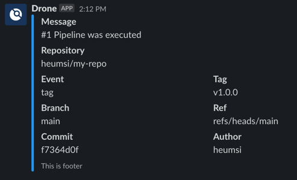

# Slack CICD Msg

Send slack message for cicd pipeline with pretty format 

## Usage

Please input value through environment variables. 
Following is an example.

```bash
$ docker run \
  -e CHANNEL_ID="your-channel-id" \
  -e USERNAME="Drone" \
  -e ICON_EMOJI=":drone-ci:" \
  -e COLOR="#2196F3" \
  -e MESSAGE="#1 Pipeline was executed" \
  -e REPOSITORY="heumsi/my-repo" \
  -e EVENT="tag" \
  -e TAG="v1.0.0" \
  -e BRANCH="main" \
  -e REF="refs/heads/main" \
  -e COMMIT="f7364d0f" \
  -e AUTHOR="heumsi" \
  -e FOOTER="This is footer" \
  -e SLACK_TOKEN="xoxb-..." \
  heumsi/slack-cicd-msg:1.0.0 
```

Then, message will appear like following.



## Dockerhub

Please find tags with version what you want in following dockerhub repository.

https://hub.docker.com/repository/docker/heumsi/slack-cicd-msg/general

## Github

If you want to know `Dockerfile`, Please find it in following repository.

https://github.com/heumsi/Dockerfiles/slack-cicd-msg
